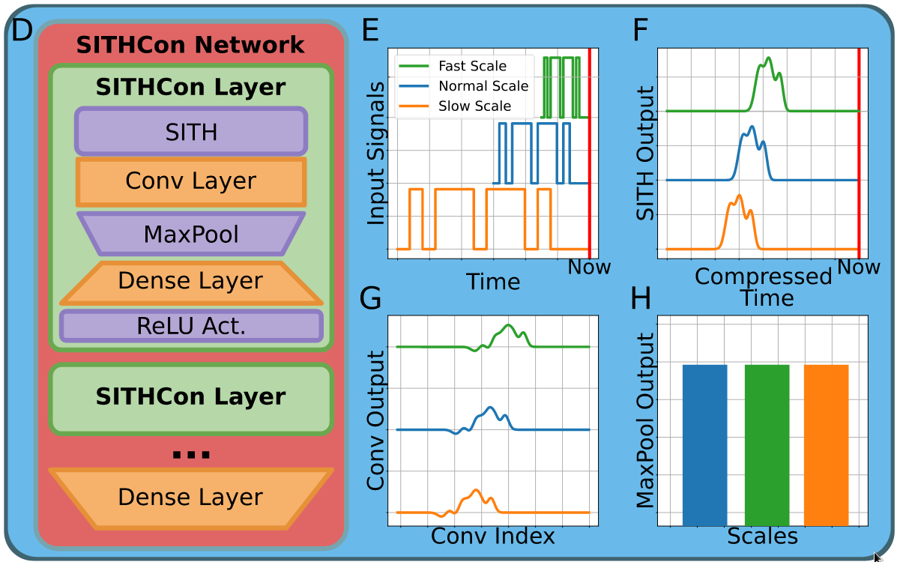

# DNN-Invariant-To-Time-Scaling

Academic project where Deep Neural Network which is invariant to Time Scaling has been explored.

Here, I have implemented the SITHCON Network mentioned in this paper. [Link](https://arxiv.org/abs/2107.04616)

More details can be found in the project report.

# Network Details

In this network, a CNN is built with a maxpool operation over a logarithmically-compressed temporal memory. The goal of this DNN is to provide a record or ”memory” of the events in the recent past as a function of time at each moment. In this method, since the logarithmic compression of data is used, time scaling can be accommodated in the network by translation of data. This model is very closely realted to the DeepSITH network developed earlier. Both these networks use SITH as a representation of the past in compressed form. However, unlike the DeepSITH, the SITHcon model has a convolution layer and maxpool operation at each layer.

# Model Architecture

# Experiments

1. Morse Adding Problem
2. Morse Decoding Problem
3. My own experiment on Audio Dataset (Arabic Numbers Dataset)
